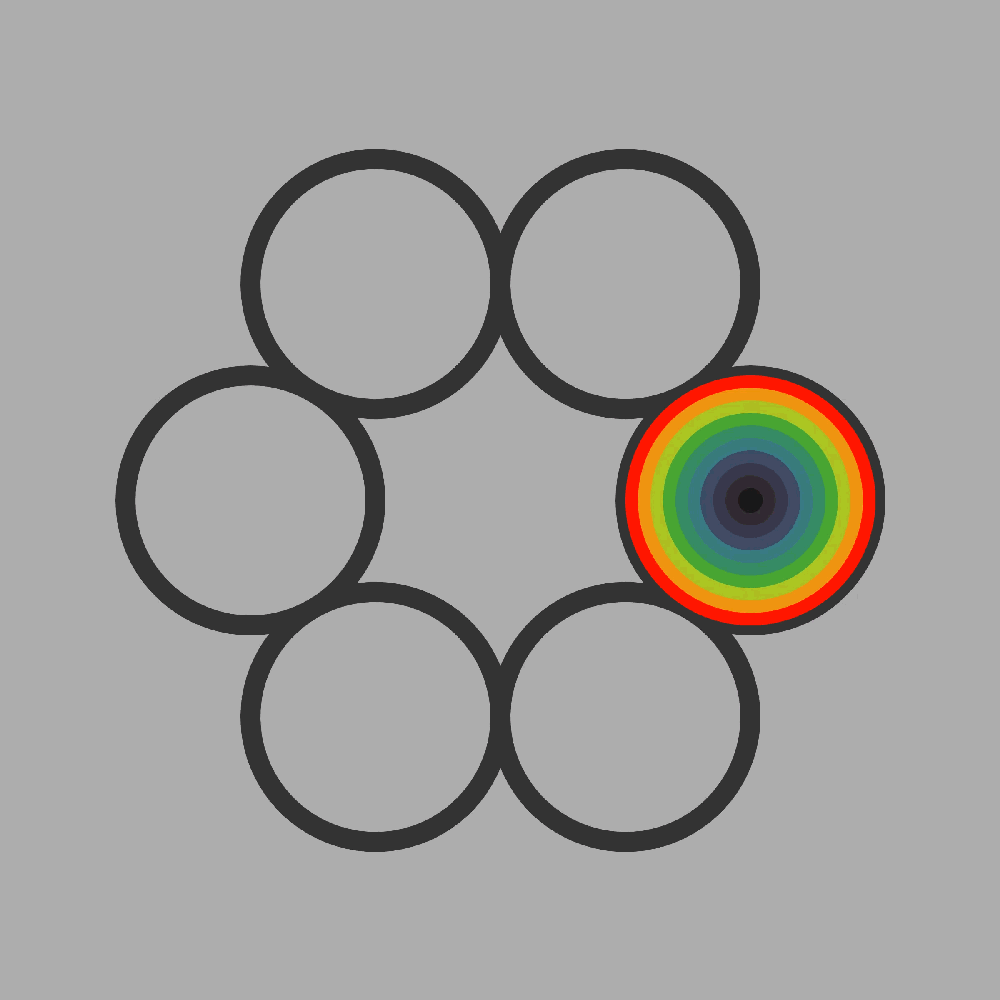

# setkch-wrapper-start-js

This repository contains the minimal example and the bundler setup (with Vitejs) to work as a starter code for using [`sketch-wrapper`](https://github.com/cdaein/sketch-wrapper).

Check out the sketch-wrapper repository for more information on what `settings` and `props` you can use and how to save image and video of your canvas, etc.

## How To

1. First, download or clone this repo into your computer. (In Github, you can click on Use This Template button.)
1. In your Command Line (Terminal) app, `cd` into the downloaded directory.
1. Run `npm install`. You will need to have [Node.js](https://nodejs.org/en/) installed on your computer.
1. Run `npm start` to start the local server.
1. Go to the local address printed on your console to see the result. The default is `http://localhost:5173/`.
1. Open the directory in your code editor (ie. VS Code)
1. Start making code changes in the `src/index.js` file.
1. When you are ready to build the project, run `npm run build`.

## License

MIT
